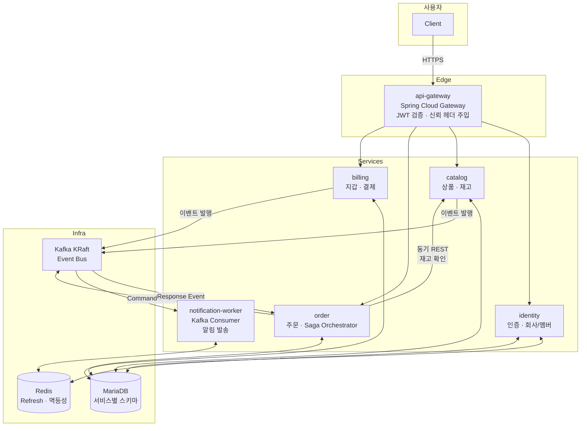
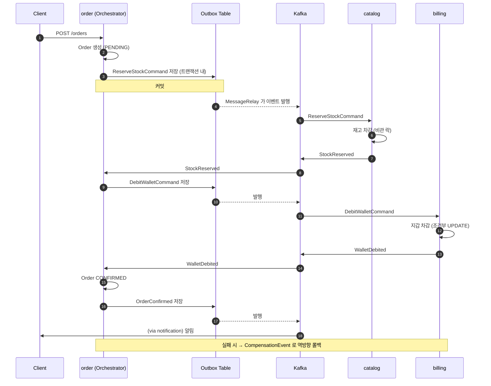
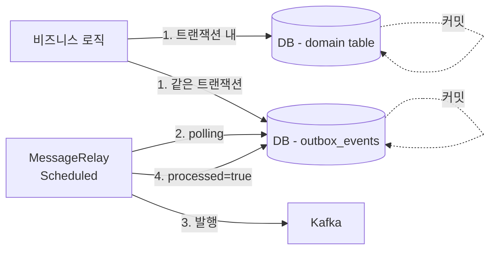
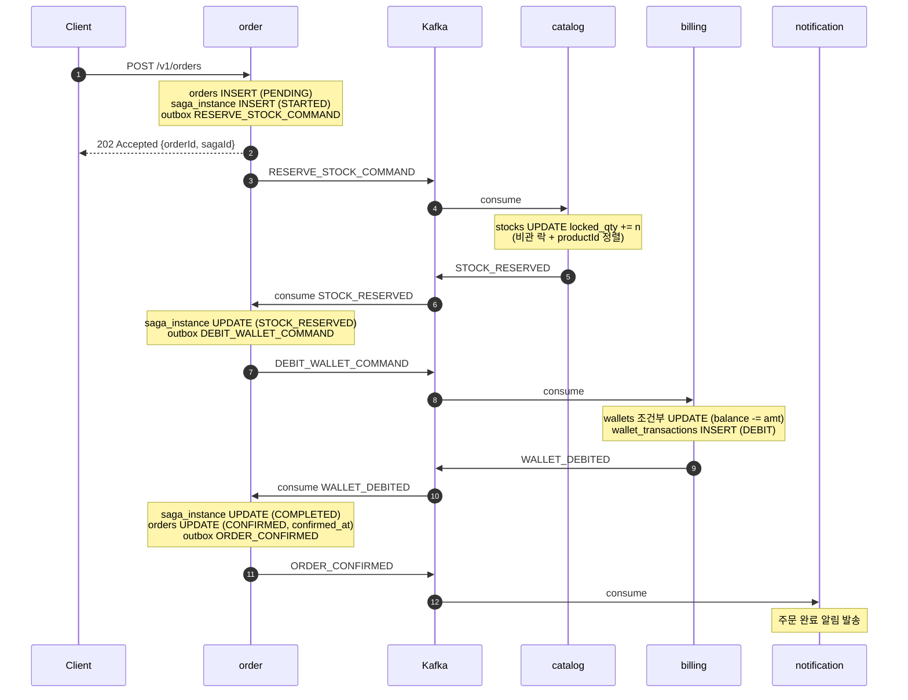
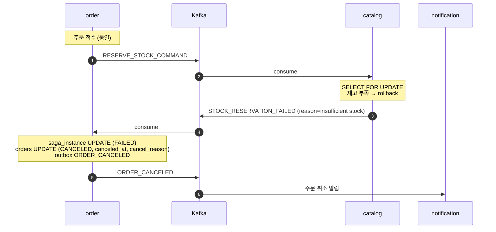
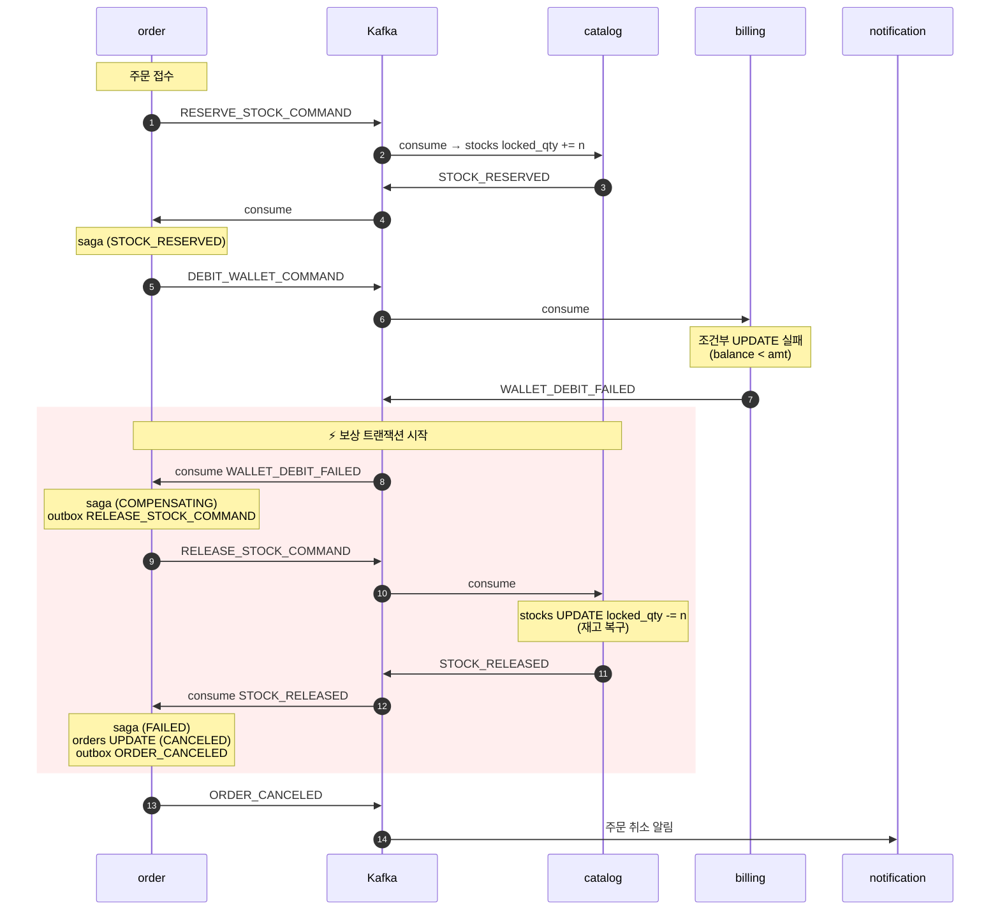
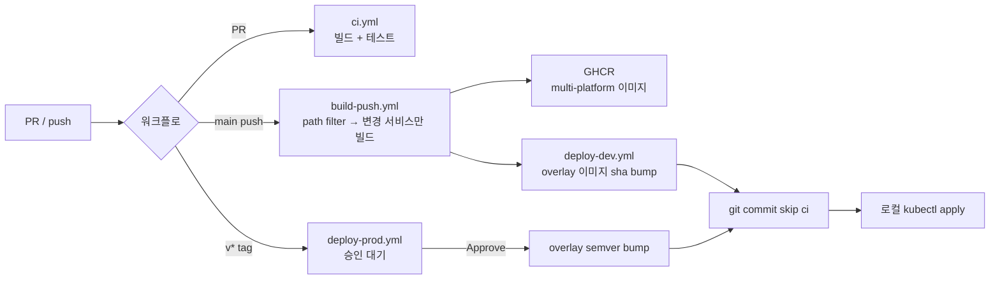

# snack24 — 사내 간식 관리 플랫폼

> 실무에서 다루기 어려운 MSA · Saga · Kubernetes · GitOps
> 한 도메인 안에서 구현하는 것을 목표로 진행하였습니다.


---

| 항목        | 내용 |
|-----------|------|
| **구성**    | MSA 6개 서비스 + Saga Orchestrator + Outbox 패턴을 Kubernetes 위에 GitOps 로 배포 |
| **주요 기술** | Java 21, Spring Boot 3.3, MariaDB, Kafka(KRaft), Redis, k3d, Kustomize, GitHub Actions, GHCR, Prometheus, Grafana |
| **배포 형태** | k3d 로컬 클러스터 + dev/prod overlay 분리, HPA + 무중단 롤링 업데이트 |
| **CI/CD** | PR 검증 → 이미지 빌드/푸시(GHCR) → 매니페스트 자동 bump → 로컬 apply 흐름 |

---

## 목차

1. [Why this project — 도메인 선정과 목표](#why-this-project)
2. [아키텍처 개요](#아키텍처-개요)
3. [핵심 기술 결정](#핵심-기술-결정)
   - [Saga Orchestration — 왜 오케스트레이션인가](#1-saga-orchestration)
   - [Outbox Pattern — 이벤트 유실 방지](#2-outbox-pattern)
   - [동시성 제어 — 지갑과 재고의 서로 다른 전략](#3-동시성-제어)
   - [Multi-tenant — Trusted Header 로 인증 위임](#4-multi-tenant--trusted-header)
   - [멱등성 — 이중 방어](#5-멱등성)
4. [관측성 (Observability)](#관측성)
5. [CI/CD 파이프라인](#cicd-파이프라인)
6. [Kubernetes 배포 전략](#kubernetes-배포-전략)
7. [로컬 실행 방법](#로컬-실행-방법)

---

## Why this project

### 프로젝트 도메인 선정 이유

B2B 기업복지 SaaS 도메인 습득을 목적으로 두었습니다.

- **다중 테넌시** — 회사(company) 단위 데이터 격리
- **분산 트랜잭션** — 주문 · 결제(지갑) · 재고가 각각 다른 서비스
- **비동기 이벤트** — 주문 확정 → 알림 발송 등
- **관리자 · 사용자 두 페르소나** — RBAC 필요성

---

## 아키텍처 개요

### 시스템 구성도



### 서비스별 역할

| 서비스 | Port | 책임                                                         | 저장소 |
|--------|------|------------------------------------------------------------|--------|
| **api-gateway** | 8000 | 라우팅 · JWT 검증 · 신뢰할수 있는 헤더 (X-Company-Id/Member-Id/Role) 주입 | — |
| **identity** | 8001 | 인증 · JWT 발급/재발급 · 회사/회원 CRUD                               | MariaDB, Redis |
| **catalog** | 8002 | 상품/재고 CRUD · 재고 예약(Saga step)                              | MariaDB |
| **order** | 8003 | 주문 · **Saga Orchestrator** · Outbox 발행                     | MariaDB |
| **billing** | 8004 | 지갑 · 차감(Saga step) · 롤백                                    | MariaDB |
| **notification-worker** | 8005 | Kafka Consumer · 알림 발송                                     | Redis (멱등성) |

## 핵심 기술 결정

### 1. Saga Orchestration

Choreography vs Orchestration 을 놓고 오케스트레이션 선택.

| 항목 | Choreography | **Orchestration (선택)** |
|------|--------------|------------------------|
| 결합도 | 낮음 | 중간 (오케스트레이터가 흐름 소유) |
| 흐름 가시성 | ❌ 분산됨 | ✅ 한 곳에서 관찰 |
| 실패 처리 | 각 서비스가 알아서 | 오케스트레이터가 보상 트랜잭션 지시 |

실무에서 주문시에 복잡하게 동작하는 주문 도메인에 대해 튜러블슈팅시에 어느단계, 어떤 사유로 실패되었는지
추적이 용이한점으로 결정

#### 주문 Saga 흐름



**보상 트랜잭션 예:**
-  "재고 수량 부족시" → `StockReservationFailed` → 주문 CANCELED (지갑의 잔액 차감 없음)
-  "지갑의 잔액 부족시" → `WalletDebitFailed` → `ReleaseStockCommand` 발행 → 재고 복구 → 주문 CANCELED

---

### 2. Outbox Pattern

*"DB 커밋은 됐는데 Kafka 발행 실패"* 또는 *"Kafka 발행은 됐는데 DB 롤백"* 같은
**이중 쓰기(dual-write) 문제** 를 방지하기 위함.

#### 흐름



---

### 3. 동시성 제어

## 비관적 락

#### 지갑 — 조건부 UPDATE

```java
    @Modifying(clearAutomatically = true)
    @Query("update Wallet w " +
            "   set w.balance = w.balance - :amount " +
            " where w.companyId = :companyId " +
            "   and w.balance >= :amount "
    )
    int debitIfSufficient(@Param("companyId") Long companyId,
                          @Param("amount") BigDecimal amount);
```
```sql
-- 성공 시 update된 행 수 = 1, 실패 시 0
UPDATE wallet
   SET balance = balance - ?,
       updated_at = NOW()
 WHERE company_id = ?
   AND balance >= ?      -- ★ 잔액 검증을 UPDATE 조건에
```

#### 재고 — 비관 락 + productId 정렬

```java
    @Lock(LockModeType.PESSIMISTIC_WRITE)
    @Query("select s from Stock s where s.productId in :productIds")
    List<Stock> findAllByProductIdInForUpdate(@Param("productIds") List<Long> productIds);
    // SELECT ... FROM products WHERE id IN (?) ORDER BY id FOR UPDATE
```

- 재고는 잔액과 달리 *"상품들의 재고 차감이 부분 성공을"* 허용 하지 않도록 구현

---

### 4. Multi-tenant — Trusted Header

Gateway 에서 JWT 검증 후 **뒤단 서비스에 신뢰 헤더** 로 전달:

```
X-Company-Id: 123
X-Member-Id: 456
X-Member-Role: ADMIN
```

Spring 의 `HandlerMethodArgumentResolver` 로 `@Caller` 어노테이션 커스텀:
각각의 서비스들은 인증에 대한 신경을 쓰지 않고 api-gateway 주입해준 헤더 정보를 쉽게 사용

```java
public class MemberController {
  @GetMapping("/me")
  public MemberDto me(@Caller CallerContext caller) {
    return memberService.findById(caller.memberId());
  }
}
```

---
## 5. Saga 시나리오별 상세 흐름

### 5.1 주문 성공



### 5.2 재고 부족 실패



### 5.3 지갑 잔액 부족 실패 (보상 트랜잭션)



---

### 6. 멱등성

이벤트 멱등성 보장:

#### Level 1 — processed_messages 테이블

각 서비스가 소유:

```sql
CREATE TABLE processed_messages (
  saga_id     VARCHAR(64),
  event_type  VARCHAR(64),
  processed_at TIMESTAMP,
  PRIMARY KEY (saga_id, event_type)
);
```

---

## 관측성

### Metrics — 인프라

#### 자동 수집 (Actuator)

- JVM (Heap, GC, Thread)
- HTTP request rate/latency (p50/p95/p99)
- Tomcat thread pool
- DB connection pool

---

## CI/CD 파이프라인

### 워크플로 구성



### 워크플로별 역할

| Workflow | 트리거 | 동작 |
|----------|--------|------|
| `ci.yml` | PR / main push | Gradle 빌드 + 테스트, JUnit 리포트 PR Checks 노출 |
| `build-push.yml` | main push, `v*` tag | Path filter → 변경 서비스만 · multi-platform(amd64+arm64) · GHCR 푸시 |
| `deploy-dev.yml` | build-push 성공 시 자동 | `overlays/dev/kustomization.yaml` 이미지 태그 sha bump (bot commit) |
| `deploy-prod.yml` | `v*` tag + **수동 승인** | GitHub Environment Required Reviewers · prod overlay semver bump |

---

## Kubernetes 배포 전략

### 매니페스트 구조

```
infra/k8s/
├── base/                        # 환경 무관 공통
│   ├── namespace.yaml
│   ├── mariadb/                 # StatefulSet + Headless Service + PVC
│   ├── redis/, kafka/
│   ├── apps/                    # 6개 서비스 Deployment + Service
│   ├── secrets/
│   └── ingress/                 # NGINX Ingress
└── overlays/
    ├── dev/                     # replicas=2, latest 태그, DEBUG 로그
    └── prod/                    # replicas=2, semver 태그, HPA 활성
```
---

## 로컬 실행 방법

### 전제 조건

- Docker Desktop (12GB 이상 권장)
- Java 21, Gradle
- `k3d`, `kubectl`, `helm`, `jq`, `hey`

### Quick Start

```bash
# 1. 로컬에 인프라 세팅 및 애플리케이션 Docker 이미지 빌드 및 k3d 이미지 import 후 시연  
  scripts/demo.sh
  
# 2. 주문 부하 시연
  MAX_ORDERS=500 ORDER_QTY=1 SLEEP_MS=10 bash scripts/saga-loop.sh  
```

### 모니터링
```bash
  kubectl port-forward -n monitoring svc/prometheus-kube-prometheus-prometheus 9090:9090
  kubectl port-forward -n monitoring svc/prometheus-grafana 3000:80   
```


