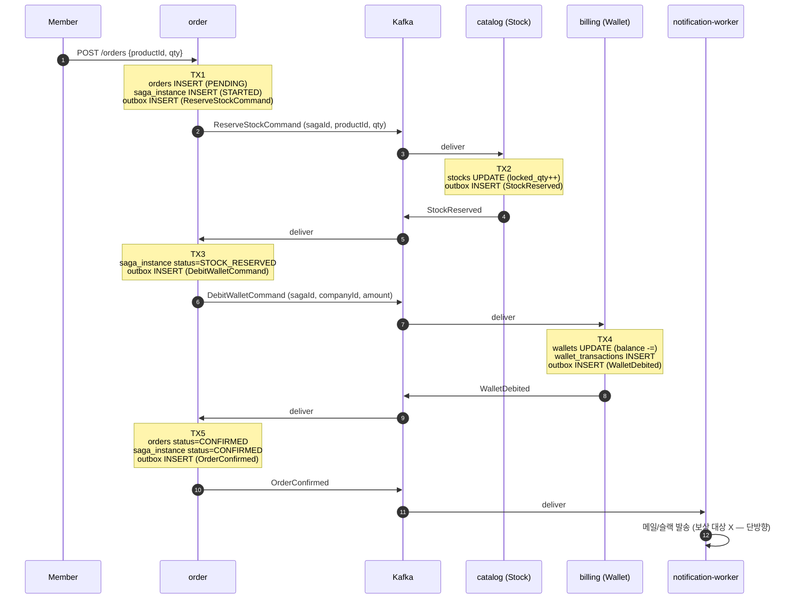
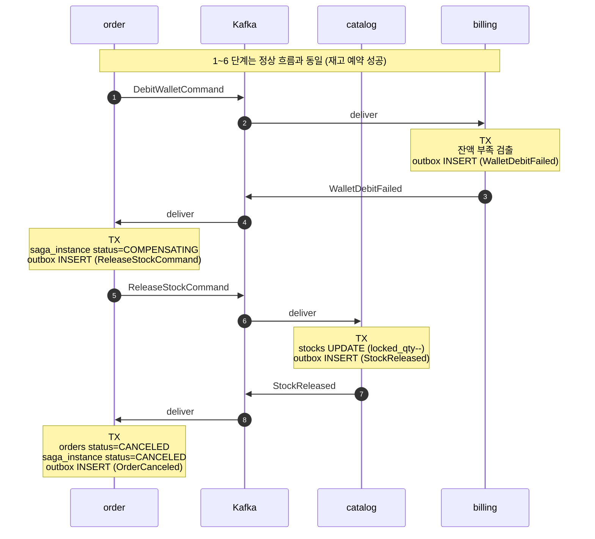

# Saga: 주문 흐름

본 문서는 주문(`order`)을 코디네이터로 하는 주문 Saga의 정상/보상 흐름과 운영 정책을 정의한다.

분산 트랜잭션 전반의 결정 근거는 [ADR 0002](adr/0002-saga-orchestration.md) 참조.

---

## 1. 명령(Command) vs 이벤트(Event)

| 구분 | 의미 | 시제 | 예시 | 생산자 |
|---|---|---|---|---|
| **Command** | "이걸 해라" — 받는 측이 거절 가능 | 명령형 | `ReserveStockCommand`, `DebitWalletCommand`, `ReleaseStockCommand` | order(코디네이터) |
| **Event** | "이게 일어났다" — 거절 불가 사실 | 과거형 | `StockReserved`, `WalletDebited`, `OrderConfirmed` | 각 도메인 서비스 |

코드 상에서는 둘 다 `Event<T extends EventPayload>` 봉투로 직렬화하되, **EventType enum의 네이밍에서 구분**한다 (예: `..._COMMAND` 접미사).

## 2. Kafka 토픽 설계

도메인별 단일 토픽 3개. 명령과 이벤트를 같은 토픽 위에 둔다.

| 토픽 | 발행 메시지 |
|---|---|
| `snack24-order` | `OrderConfirmed`, `OrderCanceled` (도메인 사실) |
| `snack24-catalog` | `ReserveStockCommand`, `ReleaseStockCommand`(in) / `StockReserved`, `StockReservationFailed`, `StockReleased`(out) |
| `snack24-billing` | `DebitWalletCommand`(in) / `WalletDebited`, `WalletDebitFailed`(out) |

**왜 토픽을 명령/이벤트로 분리하지 않았는가:**
운영 부담(토픽 12개)에 비해 학습 가치가 낮다. 메시지 봉투의 `type` 필드와 `sagaId` 헤더로 구분하면 충분. 만약 도메인이 커지고 명령 처리 권한이 분리돼야 할 시점이 오면 그때 분리한다 ("YAGNI 우선").

**파티션 키:** `sagaId` — 같은 saga의 메시지가 같은 파티션에 들어가 순서 보장.

## 3. Saga 상태 영속화

코디네이터(order 서비스)는 진행 상태를 자기 DB에 저장한다. 시스템 재시작 시 진행 중 saga 복구 가능.

```
saga_instance
├── saga_id        BIGINT PK (snowflake)
├── order_id       BIGINT (어떤 주문에 대한 saga 인지)
├── status         ENUM
│                  STARTED → STOCK_RESERVED → WALLET_DEBITED → CONFIRMED
│                                                            ↘ COMPENSATING → CANCELED
├── current_step   INT
├── started_at     DATETIME(6)
├── updated_at     DATETIME(6)
├── timeout_at     DATETIME(6)   -- 단계별 응답 대기 마감
└── error_reason   VARCHAR(500)  -- 실패 시
```

## 4. 정상 흐름



핵심: **모든 단계가 "자기 DB UPDATE + outbox INSERT"를 한 트랜잭션으로 묶음.** outbox 패턴이 메시지 발행을 보장.

## 5. 보상 흐름 — 잔액 부족 케이스



알림은 발송하지 않거나, "주문 실패" 알림만 발송 (이는 보상 불가능 행위가 아니므로 OK).

## 6. 분산 시스템 함정과 대응

### 6.1 멱등성 (Idempotency)

**문제**: Kafka는 at-least-once. 같은 메시지가 두 번 도달 가능. `WalletDebited` 가 두 번 처리되면 잔액이 두 번 차감.

**대응**:
- 모든 Command/Event 메시지에 `(sagaId, step)` 멱등 키 부여
- 수신 측에 `processed_messages(saga_id BIGINT, step INT, processed_at DATETIME, PRIMARY KEY(saga_id, step))` 테이블
- 메시지 처리 시 INSERT 시도 → UNIQUE 제약 위반이면 이미 처리된 메시지 → 무시
- 또는 saga_instance.status 머신 상태로 검증 (이미 CONFIRMED면 후속 메시지 무시)

### 6.2 메시지 순서 보장

**문제**: Saga 1단계 응답이 2단계 응답보다 늦게 도착하면 코디네이터 혼란.

**대응**: Kafka 파티션 키 = `sagaId`. 같은 saga의 메시지는 항상 같은 파티션 → 순서 보장.

### 6.3 타임아웃과 DLQ

**문제**: catalog가 응답 안 함. Saga가 STARTED 상태로 영원히 멈춤.

**대응**:
- `saga_instance.timeout_at` 컬럼 활용
- 스케줄러가 1분 주기로 `WHERE status IN (STARTED, STOCK_RESERVED, WALLET_DEBITED, COMPENSATING) AND timeout_at < NOW()` 조회 → 보상 트리거
- 보상도 실패한 메시지는 **DLQ 토픽** (`snack24-order-dlq` 등)으로 이동 → 운영자 수동 개입 영역
- DLQ 처리는 운영 모니터링 대시보드의 영역. 본 프로젝트는 DLQ 토픽 분리까지만 구현하고 운영 콘솔은 미구현 (README에 명시).

### 6.4 알림은 보상 불가능

**문제**: 알림 발송 후 후속 단계가 실패하면 메일을 회수할 수 없음.

**대응**: 알림은 `OrderConfirmed` 이후로만 발송. Saga 진행 중에는 절대 외부 통신을 하지 않는다 (메일/슬랙/SMS 등).

### 6.5 Wallet 차감의 동시성

**문제**: 같은 회사의 두 직원이 동시에 픽업 → `DebitWalletCommand` 두 개가 거의 동시 도착. 두 핸들러가 모두 잔액 충분으로 보고 차감하면 음수 가능.

**대응**: billing 내부 트랜잭션에서 다음 중 하나:
- `SELECT ... FOR UPDATE` (비관적 락) — 명료하지만 느림
- `UPDATE wallets SET balance = balance - :amount WHERE company_id = :id AND balance >= :amount` (조건부 update) — 빠름. 영향받은 row 수가 0이면 잔액 부족으로 판단

본 프로젝트는 **조건부 update** 우선 사용. 필요 시 동시성 비교 학습 차원에서 비관적 락 버전도 추가 작성.

### 6.6 코디네이터 재시작 시 진행 중 Saga 복구

**문제**: order 서비스가 STOCK_RESERVED 단계에서 재시작. 다음 명령(DebitWalletCommand) 발행은 누가?

**대응**:
- saga_instance와 outbox가 항상 같은 트랜잭션에 들어감 (이미 outbox 패턴이 보장)
- 재시작 후 outbox poller가 미발행 메시지 자동 처리
- 추가 안전장치: 부팅 시점에 `saga_instance WHERE status NOT IN (CONFIRMED, CANCELED) AND updated_at < NOW() - 5min` 조회 → 재처리 트리거 (멱등이라 안전)

## 7. 운영 정책 요약

| 항목 | 정책 |
|---|---|
| 멱등 키 | `(sagaId, step)` |
| 파티션 키 | `sagaId` |
| 단계별 타임아웃 | 30초 |
| 보상 시작 트리거 | (a) 실패 이벤트 수신 (b) timeout_at 초과 |
| DLQ | `snack24-{domain}-dlq` (보상도 실패한 메시지) |
| 알림 발송 시점 | `OrderConfirmed` 이후만 |
| 잔액 차감 동시성 | 조건부 update 우선, 비관적 락은 비교 학습용 |
| Saga 상태 저장 | `saga_instance` 테이블 (order DB) |

## 8. 미구현 명시 (README/면접 정직성 차원)

- DLQ 모니터링 콘솔 미구현 (운영 도구 영역)
- Saga 시각화 도구(예: AWS Step Functions UI 류) 미구현 — 로깅으로 대체
- 분산 트레이싱(Zipkin) 도입은 Week 8 여유 시 (Micrometer Tracing)
